# Guide to Setting Up Grafana Dashboard for Node Monitoring

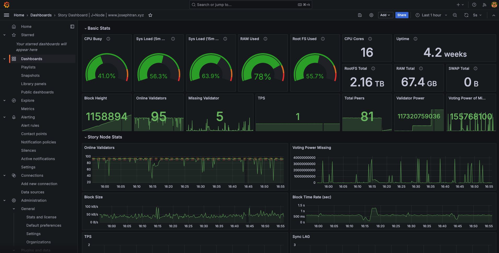

# Overview
To set up an effective node monitoring system, we'll use three main tools:

1. Prometheus: Collects and stores metrics.
2. Node Exporter: Gathers metrics from the system and hardware.
3. Grafana: Displays data in graphs and dashboards.

# System Requirements

- Operating System: Ubuntu 20.04 LTS or newer
- RAM: Minimum 2GB
- CPU: 2 cores or more
- Disk Space: At least 20GB free

# Implementation Steps

## 1. Installing Prometheus
Prometheus is an open-source monitoring system and time series database.
- Download and install Prometheus:

```bash
cd $HOME
wget https://github.com/prometheus/prometheus/releases/download/v2.42.0/prometheus-2.42.0.linux-amd64.tar.gz
tar xvf prometheus-2.42.0.linux-amd64.tar.gz
sudo mkdir -p /opt/prometheus
sudo cp -r prometheus-2.42.0.linux-amd64/* /opt/prometheus/
rm -f prometheus-2.42.0.linux-amd64.tar.gz
```
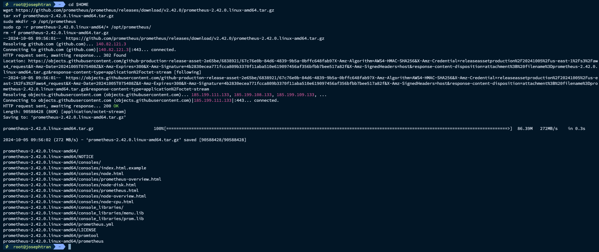

- Create Prometheus user:

```bash
sudo useradd --no-create-home --shell /bin/false prometheus
```
- Create necessary directories:
```
sudo mkdir /etc/prometheus
sudo mkdir /var/lib/prometheus
sudo touch /etc/default/prometheus
```
- Configure permissions:
```bash
sudo chown -R prometheus:prometheus /etc/prometheus /var/lib/prometheus /opt/prometheus
sudo chmod 755 /opt/prometheus/prometheus
```
- Create Prometheus configuration file:
```
sudo nano /etc/prometheus/prometheus.yml
```
Insert Prometheus configuration content:
```
# Sample config for Prometheus.

global:
  scrape_interval:     15s # Set the scrape interval to every 15 seconds. Default is every 1 minute.
  evaluation_interval: 15s # Evaluate rules every 15 seconds. The default is every 1 minute.
  # scrape_timeout is set to the global default (10s).


# Attach these labels to any time series or alerts when communicating with
# external systems (federation, remote storage, Alertmanager).


# Alertmanager configuration
alerting:
  alertmanagers:
  - static_configs:
    - targets: ['localhost:9093']

# Load rules once and periodically evaluate them according to the global 'evaluation_interval'.
rule_files:
  # - "first_rules.yml"
  # - "second_rules.yml"

# A scrape configuration containing exactly one endpoint to scrape:
# Here it's Prometheus itself.
scrape_configs:
  # The job name is added as a label `job=<job_name>` to any timeseries scraped from this config.
  - job_name: 'prometheus'

    # Override the global default and scrape targets from this job every 5 seconds.
    scrape_interval: 5s
    scrape_timeout: 5s

    # metrics_path defaults to '/metrics'
    # scheme defaults to 'http'.

    static_configs:
      - targets: ['localhost:9090']

  - job_name: node-exporter
    # If prometheus-node-exporter is installed, grab stats about the local
    # machine by default.
    static_configs:
      - targets: ['PUBLIC_SERVER_IP:9200']
  
  - job_name: 'Story'
    static_configs:
      - targets: ['PUBLIC_SERVER_IP:26660']
```
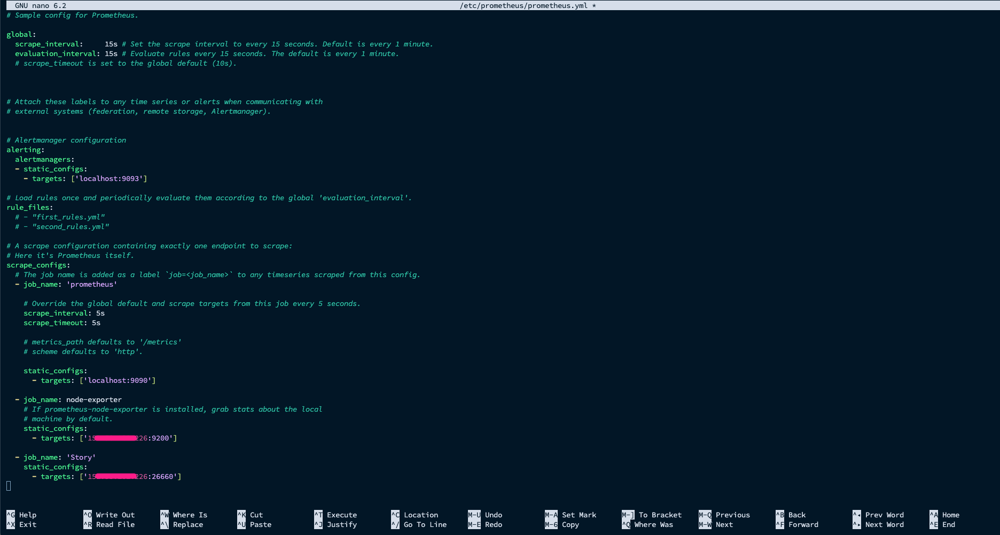

Explain config:
```bash
- job_name: 'Story'
    static_configs:
      - targets: ['PUBLIC_SERVER_IP:26660']
```

- For config this port `PUBLIC_SERVER_IP:26660` you have to edit file at `$HOME/.story/story/config/config.toml` and Restart Story node

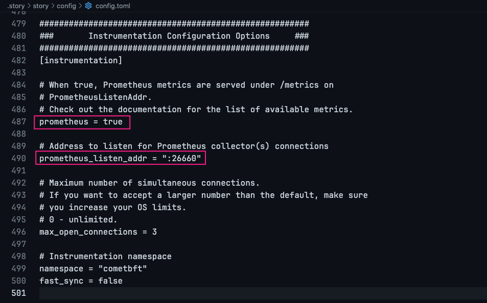

Set permissions for the configuration file
```bash
sudo chown prometheus:prometheus /etc/prometheus/prometheus.yml
```
- Create service file:
```bash
sudo nano /etc/systemd/system/prometheus.service
```
Insert service content:
```
[Unit]
Description=Monitoring system and time series database
Documentation=https://prometheus.io/docs/introduction/overview/ man:prometheus(1)
After=time-sync.target

[Service]
Restart=on-failure
User=prometheus
EnvironmentFile=/etc/default/prometheus
ExecStart=/opt/prometheus/prometheus $ARGS --web.listen-address=:9099 --config.file=/etc/prometheus/prometheus.yml --storage.tsdb.path=/var/lib/prometheus
ExecReload=/bin/kill -HUP $MAINPID
TimeoutStopSec=20s
SendSIGKILL=no

# systemd hardening-options
AmbientCapabilities=
CapabilityBoundingSet=
DeviceAllow=/dev/null rw
DevicePolicy=strict
LimitMEMLOCK=0
LimitNOFILE=8192
LockPersonality=true
MemoryDenyWriteExecute=true
NoNewPrivileges=true
PrivateDevices=true
PrivateTmp=true
PrivateUsers=true
ProtectControlGroups=true
ProtectHome=true
ProtectKernelModules=true
ProtectKernelTunables=true
ProtectSystem=full
RemoveIPC=true
RestrictNamespaces=true
RestrictRealtime=true
SystemCallArchitectures=native

[Install]
WantedBy=multi-user.target
```
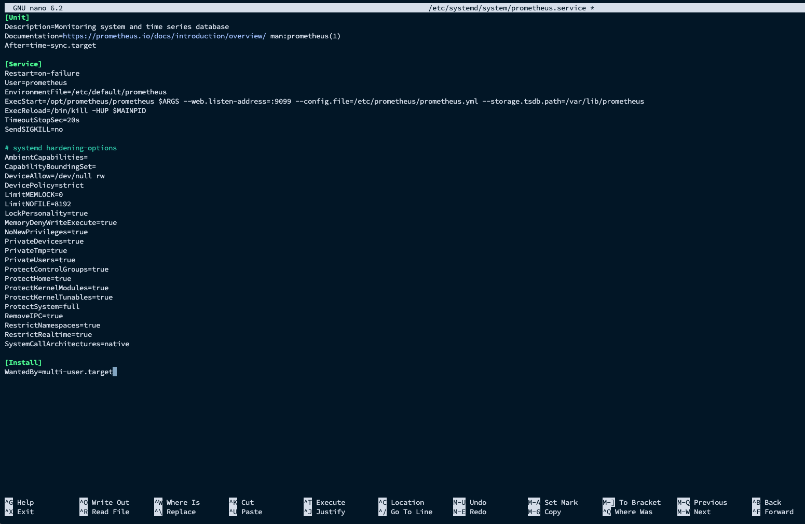

- Start Prometheus:
```
sudo systemctl daemon-reload
sudo systemctl enable prometheus
sudo systemctl start prometheus
sudo systemctl status prometheus
```
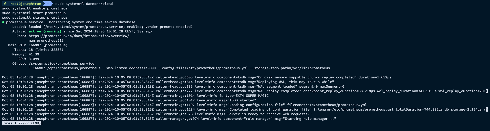

## 2. Installing Node Exporter
Node Exporter collects hardware and OS metrics.
- Download and install Node Exporter:
```
cd ~
wget https://github.com/prometheus/node_exporter/releases/download/v1.5.0/node_exporter-1.5.0.linux-amd64.tar.gz
tar xvf node_exporter-1.5.0.linux-amd64.tar.gz
sudo cp node_exporter-1.5.0.linux-amd64/node_exporter /usr/local/bin/
```
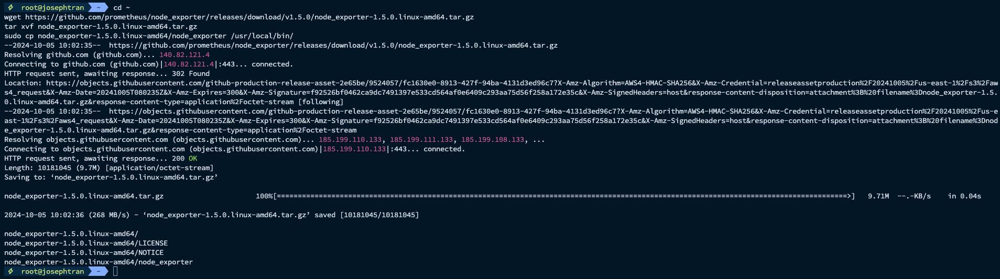

- Create service file:
```
sudo nano /etc/systemd/system/node_exporter.service
```
Insert service file content:
```bash
[Unit]
Description=Node Exporter
Wants=network-online.target
After=network-online.target

[Service]
User=root
ExecStart=/root/node_exporter-1.5.0.linux-amd64/node_exporter --web.listen-address=:9200
Restart=always

[Install]
WantedBy=default.target

```
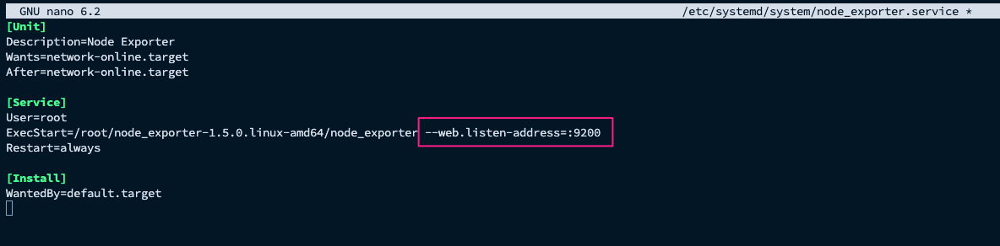
- You can custom port if get conflict

- Start Node Exporter:
```
chmod +x /root/node_exporter-1.5.0.linux-amd64/node_exporter
systemctl daemon-reload
sudo systemctl enable node_exporter
systemctl start node_exporter
systemctl status node_exporter
```
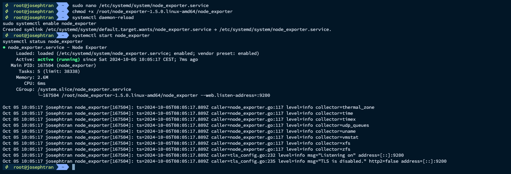

## 3. Installing Grafana
Grafana is an open-source platform for data analytics and visualization.
- Install Grafana:
```bash
sudo apt-get install -y software-properties-common
sudo add-apt-repository "deb https://packages.grafana.com/oss/deb stable main"
wget -q -O - https://packages.grafana.com/gpg.key | sudo apt-key add -
sudo apt-get update
sudo apt-get install grafana
sudo systemctl enable grafana-server
```
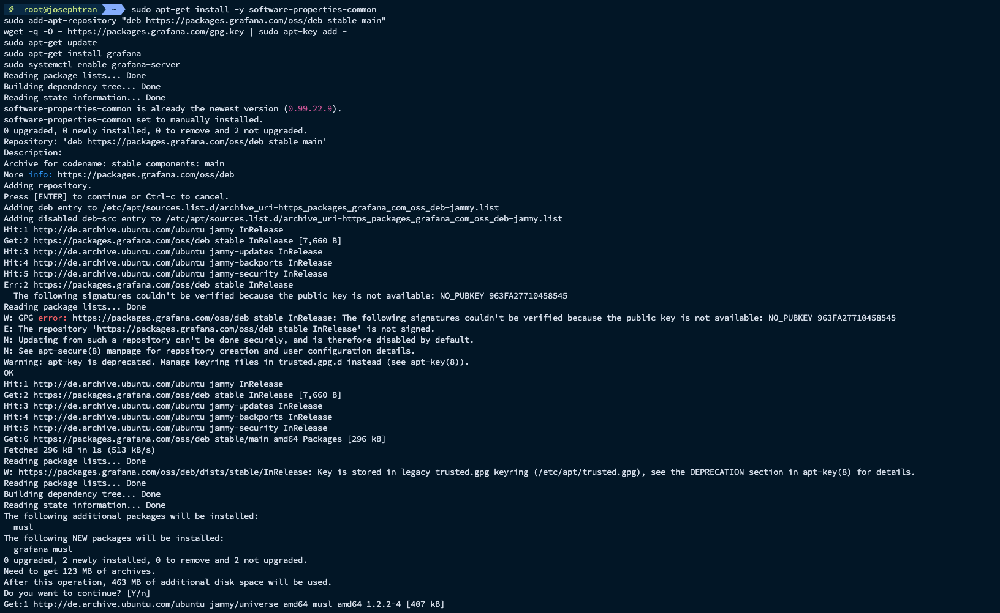

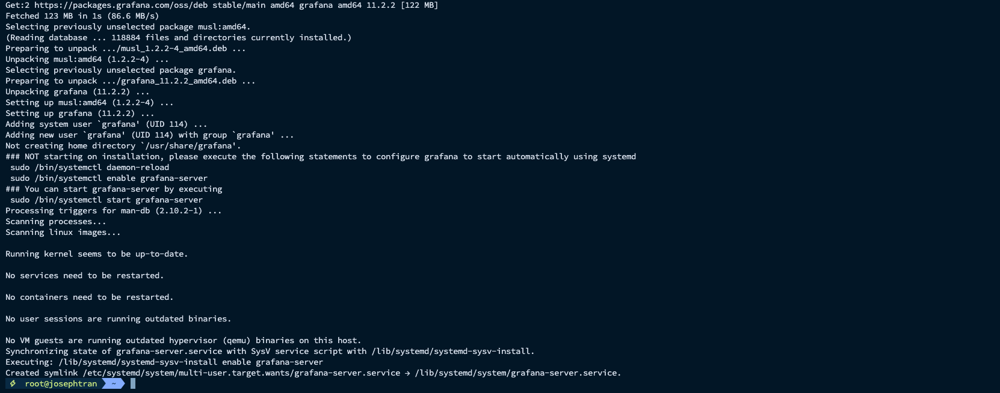

- Start Grafana:
```
sudo systemctl start grafana-server
sudo systemctl status grafana-server
```

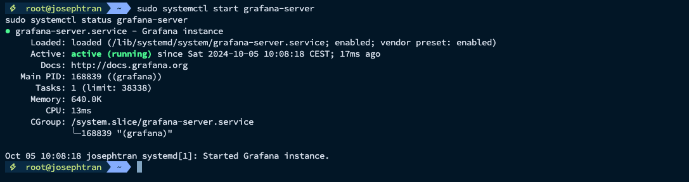

## 4. Configuring Grafana Dashboard

- Access Grafana web interface:
Open your browser and navigate to `http://your_server_ip:3000`

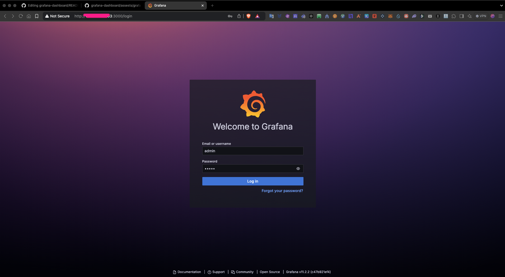

- Default login: `admin/admin` then change to your password

- Add Prometheus as a data source:
Click `"Add new data source"` and select Prometheus

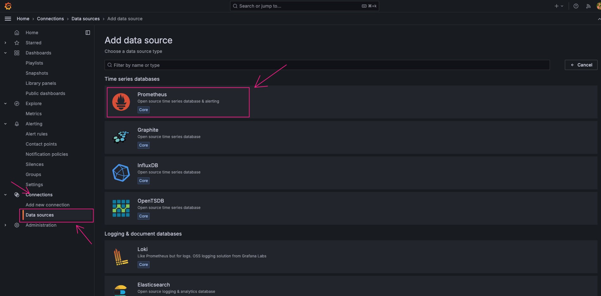

Enter http://localhost:9099 as the Prometheus server URL. (This port the same port in Prometheus service config)

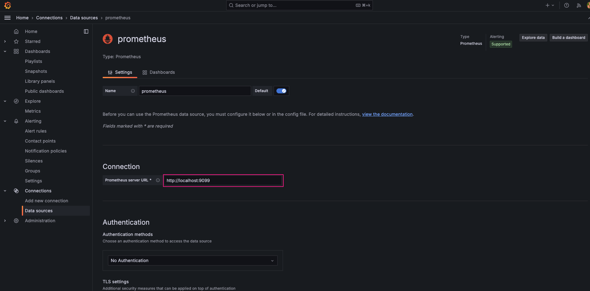

Click `"Save & Test"` at the bottom

- Import Dashboard:
Go to Dashboards and click "Upload JSON file"

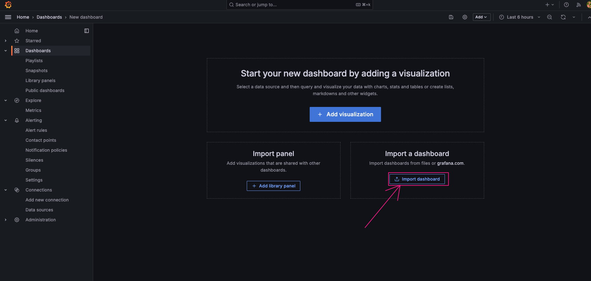

Upload the downloaded JSON file
Select the Prometheus data source you just added

Download the Story-grafana-json-file from [https://story.josephtran.co/story_validator.json](https://story.josephtran.co/story_validator.json)

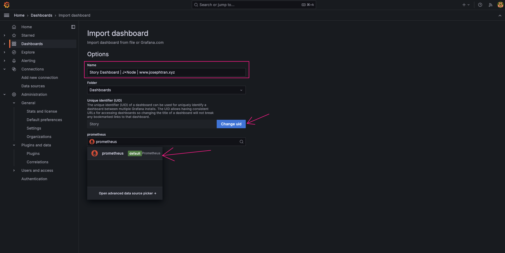

- Customize Dashboard:

Adjust time ranges, add new panels, or modify existing ones as needed


## 5. Troubleshooting

- If Prometheus fails to start, check the configuration file for syntax errors
- Ensure all necessary ports are open in your firewall
- Check service logs using `journalctl -u [service_name]` for any error messages

## 6. Maintenance

- Regularly update Prometheus, Node Exporter, and Grafana to their latest versions
- Backup your Grafana dashboards and Prometheus data periodically
- Monitor disk usage of the Prometheus data directory

Conclusion
You now have a fully functional monitoring system for your node. This setup allows you to visualize system metrics, set up alerts, and gain insights into your node's performance. Remember to regularly check and update your monitoring setup to ensure it remains effective and secure.

This comprehensive guide should provide a solid foundation for setting up Grafana to monitor your node. It covers all the necessary steps from installation to configuration, and includes some basic troubleshooting and maintenance tips.
